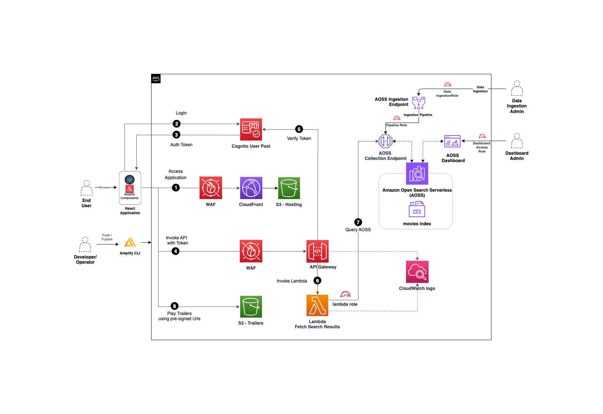

# Movie search application using open search serverless

This prototype project is intended to show a way to implement multi dimensional search capability using [Amazon OpenSearch Serverless](https://docs.aws.amazon.com/opensearch-service/latest/developerguide/serverless-overview.html) and [AWS Amplify](https://aws.amazon.com/amplify/) services. This application provides the logged in user with the ability to search for movies based on text matching the title, description, actor and directors from the movies collection. The search result provides the movie title, description, image, imdb movie link, actors and a link to open up the movie trailer. It also allows sorting and pagination of the search results. 

## Deploy the application
### Prerequisite

- Install [Nodejs](https://nodejs.org/en/download/) Latest LTS Version. (Project uses Nodejs 20.11.0 and npm 10.2.4)
- Install [Amplify CLI](https://docs.amplify.aws/react/start/getting-started/installation/#install-the-amplify-cli).
- Install [awscurl](https://github.com/okigan/awscurl) for data ingestion.

### Backend

- Clone this repository to your local computer.
- In the terminal, from the amplify/backend folder execute `npm install` to install all dependencies.
- Repeat the dependency installation in these folders  - amplify/backend/custom/opensearchserverless, amplify/backend/custom/waf01222014
  and amplify/backend/function/moviesearch56199296
- Run `amplify init` command to initialize the [amplify](https://docs.amplify.aws/javascript/tools/cli/start/key-workflows/#amplify-init) project based on the contents of the directory.
- Update the ip-address of your machine in the WAF rules to allow traffic from the ip-set [here](amplify/backend/custom/waf01222014/cdk-stack.ts)(line 41).
- Run `amplify push` to build and deploy the backend resources, resource list would be as below.
    

  After successful deployment, the resource metadata will be saved in <B>amplify-meta.json</B>

### Frontend
- From the project's root folder, run `npm install` to install the frontend dependencies.
- Optionally, you can run `npm audit --production` to check on vulnerabilities in the packages and fix them.
- Run `npm run start` to launch the react application locally from the browser. The required configurations to backend resources like API, Cognito etc will be in <B>amplifyconfiguration.json</B>. Open [http://localhost:3000](http://localhost:3000) to view it in your browser.
- To publish the frontend react application on to cloudfront, run `amplify publish`.

### Note
Add a WAF to mitigate common web threats and protect cloudfront distribution by manual [one-click](https://aws.amazon.com/blogs/networking-and-content-delivery/mitigate-common-web-threats-with-one-click-in-amazon-cloudfront/) configuration in the amazon cloudfront distribution.

## Architecture

- <B>Front End Application</B> is a react application which is hosted on a cloudfront distributed S3 bucket. The application uses [Amplify UI](https://ui.docs.amplify.aws/) which is a collection of react components that can connect directly to the cloud. We use the Authenticator component of amplify UI to enable authentication flows like sign-up, sign-in, sign-out and works seamlessly with amplify CLI to connect with AWS Cognito. Cloud distribution is protected from common web threats by adding a [WAF](https://aws.amazon.com/blogs/networking-and-content-delivery/mitigate-common-web-threats-with-one-click-in-amazon-cloudfront/)
- <B>Authentication</B>: Application access is controlled using [Amazon Cognito](https://aws.amazon.com/cognito/), it provides a robust set of APIs to build a self-registration solution. We use the Cognito User pools to securely store user profile data recieved from the sign-up page. Multi-factor authentication (MFA) is configured in the user pool and application users can verify their identities using Time-based One-time Password (TOTP) generator, such as Google Authenticator.
- <B>Backend Application</B>: AWS APIgateway service is used to create an endpoint to fetch search result, it is integrated with a lambda and uses cognito authorizer to authenticate the incoming requests. It is also protected by WAF with rule configured to allow traffic from a set of ip-address. The lambda takes in the search text, converts into `domain-specific language (DSL)` query and invokes the open search collection endpoint. The result from opensearch query is returned back to the application. Open search serverless service automatically provisions and continually adjusts to get fast data ingestion rates and millisecond response times for searches. The movie trailers are saved in the S3 and accessed from the application using presigned urls. (This prototype project uses S3 for trailers, its a pattern to demo the file download capability based on search result details).  

## Data Ingestion
  - The sample [movie data](project_assets/movies-data.json) is ingested into Open Search Serverless Collection. The custom CDK resouce - [opensearchserverless](amplify/backend/custom/opensearchserverless/constructs/opensearch-contruct.ts) creates the collection, dataaccess policy, network policy and the pipeline for data ingestion into `Movies` index. The output from the cdk resource creation includes endpoints for ingestion, collection and dashboard. Replace the ingestion endpoint and region in the below snippet and execute the awscurl command to save data into collection.
    ```
    awscurl --service osis --region <region> \                         
      -X POST \
      -H "Content-Type: application/json" \
      -d "@project_assets/movies-data.json" \
      https://<ingest_url>/movie-ingestion/data
    ```
    You should see a `200 OK` response.

  - Optional Step : Log into AWS console and select S3 service, open the trailer S3 bucket(created as part of backend deployment) and upload some movie trailers. Ensure that the file name matches the id field in sample [movie data](project_assets/movies-data.json) (ex:"tt1981115.mp4", "tt0800369.mp4", "tt0172495.mp4"). Uploading a trailer with id "tt0172495.mp4" is used as the default trailer for all movies, without having to upload one for each movie. If this step is ommited , the `movie trailer` functionality will not work.

## Application Flow
### Create User Account
  * User signs-up for application access by entering Username, password (rule - should be atleast 8 character length, should include atleast one uppercase character and symbol) and email address.

    

### Verify Account
  * Verify your account by entering the confirmation code recieved in your email.

    

### MFA verification
  * Setup Time-based One-time Password (TOTP) by scanning the image using authenticator app like Google Authenticator. Enter the code generated in the app and confirm.

    

### Application Login
  * Once the account is verified, user will be seeing the Movie Finder page.

    

### Search Movie
  * User can search for movie-name/actor/director and view the search results.

    

### Movie Details
  * User can click on the movie tiles to view the movie details.

    

### Movie Trailer
  * User can click on the `WATCH TRAILER` link to view the movie trailer. Click out the trailer window to return back to search results page.

    


### Other Movie details
  * User can click other movie tiles to get respective movie details and trailers.

    

### Pagination
  * In case of large search results, the pagination links at the bottom can be clicked to view more movie results.

    

## Cleanup
- Pull the backend environment associated with the application to your local environment by running `amplify pull` command.
- Within the project directory, run the `amplify delete` command.